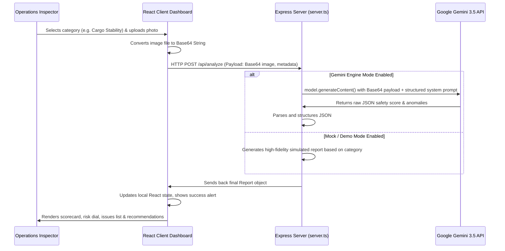
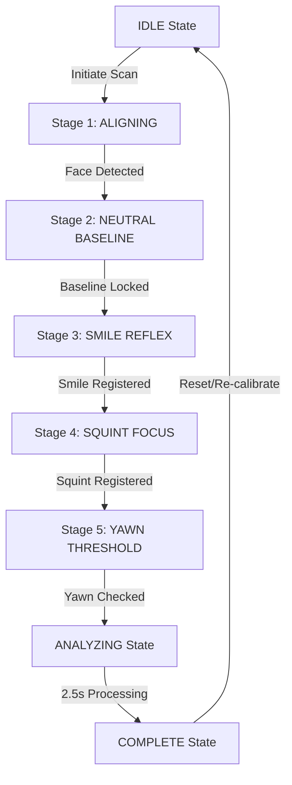

# TransitMind AI - Comprehensive Project Walkthrough

This document provides a comprehensive guide to the architecture, operational workflow, and key features of the **TransitMind AI** logistics intelligence platform.

---

## 🛠️ How the Project Works (System Flow)

TransitMind AI is a full-stack web application designed to run locally or on containerized cloud services. The application consists of a React frontend integrated directly with an Express backend proxying Google's Gemini Vision models.

### 1. The Visual Analysis Pipeline (End-to-End Flow)



### 2. State & Data Persistence
- **In-Memory Store**: The server maintains a persistent, mutable array (`reportsDatabase`) in memory containing past safety inspections. This keeps data alive across client browser reloads during demonstration phases.
- **Client Sync**: On page load, the frontend makes a fetch request to `GET /api/reports` to sync the state and populate the recent audit tables.

### 3. PDF Generator Engine
- When an inspector triggers an export, the client-side `jspdf` compilation library builds a structured, high-fidelity PDF document on the fly.
- It parses metadata, formats long text paragraphs into clean multiline segments, compiles the listed hazards/action directives, and wraps the content in a navy and cyan vector frame with a digital security seal.

---

## 🌟 Core Features

### 1. Cinematic Landing Portal
- A gorgeous dark-mode welcome screen featuring futuristic glowing accents, glassmorphic buttons, and scrolling brand logos.
- Provides immediate gateways to the main monitoring metrics or the visual scanning interface.

### 2. Command Center Dashboard
- **Overall System Health Gauges**: Renders overall safety ratios and yard efficiency ratings.
- **Risk Distribution Charts**: Built with `recharts` to map out risk trends over time and display alert categorizations.
- **Recent Inspections Vault**: A tabular log of past audits with severity badges and visual preview triggers.
- **Depot & Fleet Map**: Visual geospatial map marking logistics terminals and vehicle locations with real-time risk alerts.

### 3. AI Risk Scanner
- **Context Configurator**: Tailor the AI's auditing context specifically for **Warehouses**, **Cargo Loading**, or **Truck Stowage**.
- **Visual Intelligence Engine**: Submits image feeds to Gemini to extract safety scores, safety levels (LOW/MEDIUM/HIGH), exact hazard locations, and severity levels.
- **Interactive Reports**: Visualizes safety indices and provides lists of issues and corrective measures.

### 4. Audit Vault & Archive
- Provides full search, categorization, and sorting capabilities for historical reports.
- Supports bulk delete operations and selection of audit baseline records.

### 5. Multi-Report Comparative Analysis
- Side-by-side comparison slider panel. 
- Allows inspectors to compare a newer audit against an older baseline report to trace if safety blockages have been cleared or straps replaced.

### 6. AI Copilot Chat Assistant
- An interactive assistant panel.
- Allows operations staff to ask questions like: *"How do I resolve Sector B blocking?"* or *"What is the standard spacing for pallet rows under OSHA guidelines?"*

### 7. Safety Route Planner
- Interactive modal calculating the safest transportation path from cargo origin to destination.
- Visualizes optimal vs. alternative routes and highlights high-risk sectors (e.g. weather warnings or poor road conditions).

### 8. Webhook & Alert Center
- Setup automatic alert protocols.
- Configure SMS notifications, email summaries, and slack webhooks for critical (HIGH severity) hazards detected by the scanner.

---

## 🧬 Biometric Fatigue & Expression Matrix System

This section outlines the implementation, functional architecture, and verification of the newly developed facial expression and cognitive fatigue scanner on the **TransitMind AI** platform.

### 1. System Overview

The **Biometric Fatigue & Expression Matrix** replaces the previous static biometrics tracker with a dynamic, guided facial expression scan sequence. This system measures an operator's facial responses under controlled calibration prompts to calculate their **Fatigue Index** and determine whether they are fit to drive.



### 2. Scan & Calibration Stages

During a calibration cycle, the driver must complete a 5-stage bio-response check. The progress bar advances as each expression's heuristic threshold is met:

| Stage | Name | Target Gesture | Purpose | Telemetry Heuristic |
|---|---|---|---|---|
| **1** | **ALIGNING** | Face Centering | Ensure the operator's face is aligned inside the HUD tracking box. | Skin pixel cluster segmentation count > threshold |
| **2** | **NEUTRAL** | Steady Face | Establish baseline eye aperture and facial line coordinates. | Lock baseline Eye Aperture Ratio (EAR) |
| **3** | **SMILE** | Smiling | Measure cognitive muscle reflex time (reflex delay in milliseconds). | Smile Curvature Index (SCI) > 0.55 |
| **4** | **SQUINT** | Squinting / Frowning | Check eye focus contraction and eyelid motor response. | Eye Aperture Ratio (EAR) < 0.48 |
| **5** | **YAWN** | Opening Mouth | Calibrate yawn amplitude thresholds to identify drowsiness. | Mouth Aspect Ratio (MAR) > 0.60 |

### 3. Computer Vision Heuristics (Canvas/Image Processing)

The client-side computer vision engine performs direct pixel analysis on the video feed to calculate coordinates and aspect ratios in real time:

*   **Eye Aperture Ratio (EAR)**: Measured by checking pupil and eyelid contrast boundaries inside the left and right eye zones. If the eyes squint or close, the EAR drops, signifying fatigue.
*   **Mouth Aspect Ratio (MAR)**: Calculated by segmenting the dark cavity inside the mouth zone. A high ratio of dark pixels indicates that the mouth is wide open (yawning).
*   **Smile Curvature Index (SCI)**: Approximated by the ratio of horizontal mouth width relative to the overall face size. A wider mouth curvature indicates a smile.
*   **Pulse Rate (PPG)**: Monitored through sub-perceptible green channel color frequency variations on the operator's forehead.

### 4. Interactive Simulation Mode

For environments without active camera access, the system features a **high-fidelity simulation matrix** with:
1.  **Manual Overrides**: Sliders that let the operator manually adjust MAR, EAR, and SCI to see the live wireframe mesh deform.
2.  **Autopilot Simulation**: Initiating a scan automatically drives the sliders through a sequence representing the neutral, smile, squint, and yawn gestures to test the fatigue scoring algorithm.

### 5. Verification & Visual Layout

#### Completed State Verification
The scanning cycle is verified to run successfully, transition to compilation, and render the results:

*   **Calibration Prompt HUD**: Transitions to `"EVALUATION GENERATED. RE-ALIGNMENT SCORE REGISTERED."`
*   **Calibration Report Card**: Details **Passed** status, smile reflex delay (e.g. `284 ms`), yawn threshold (e.g. `12%`), and gaze stability (e.g. `87%`).
*   **Fatigue Verdict**: Displays calculated **Fatigue Index** and a status badge (**NORMAL**, **WARNING**, or **CRITICAL**).
*   **Reversion**: The scan action button reverts to **INITIATE SCAN CYCLE** upon completion.


### 6. Implementation Log Diff

Here is the diff showing the fix applied to resolve the state compilation loop bug:

```diff
  // Keep values updated in a ref to avoid clearing the analyzing timeout due to sub-second sensor state updates
  const scanDataRef = useRef({
    selectedDriverId,
    selectedDriverName: selectedDriver.name,
    maxObservedYawn,
    ear,
    recordedSmileTime,
    mar
  });

  useEffect(() => {
    scanDataRef.current = {
      selectedDriverId,
      selectedDriverName: selectedDriver.name,
      maxObservedYawn,
      ear,
      recordedSmileTime,
      mar
    };
  });

  // Analyzing Step compilation
  useEffect(() => {
    if (scanStep !== "ANALYZING") return;

    const timer = setTimeout(() => {
      const { 
        selectedDriverId: currentId, 
        selectedDriverName: currentName, 
        maxObservedYawn: currentYawn, 
        ear: currentEar, 
        recordedSmileTime: currentSmileTime, 
        mar: currentMar 
      } = scanDataRef.current;

      // Complete scan and determine driver metrics
      setScanStep("COMPLETE");
      setPromptMessage("EVALUATION GENERATED. RE-ALIGNMENT SCORE REGISTERED.");
      
      // Calculate final outcomes based on scanning variables
      const yawnFatigueFactor = currentYawn > 70 ? (currentYawn - 40) * 1.2 : 0;
      const eyeFatigueFactor = currentEar < 0.35 ? 35 : 5;
      const computedFatigue = Math.round(Math.min(100, Math.max(5, (yawnFatigueFactor + eyeFatigueFactor + (currentSmileTime > 300 ? 15 : 0)))));
      
      let finalLevel: "NORMAL" | "WARNING" | "CRITICAL" = "NORMAL";
      if (computedFatigue > 70) {
        finalLevel = "CRITICAL";
      } else if (computedFatigue > 40) {
        finalLevel = "WARNING";
      }

      const reflexTime = currentSmileTime || Math.round(200 + Math.random() * 120);
      const finalYawnVal = currentYawn || Math.round(currentMar * 100);

      // Commit to driver roster
      setDrivers(prev => prev.map(d => {
        if (d.id !== currentId) return d;
        return {
          ...d,
          fatigueIndex: computedFatigue,
          stressLevel: finalLevel,
          expressionScanStatus: computedFatigue > 70 ? "CRITICAL" : computedFatigue > 40 ? "WARNING" : "PASSED",
          lastScanTime: new Date().toLocaleTimeString(),
          smileReflexTime: reflexTime,
          maxMouthAperture: finalYawnVal,
          gazeStability: Math.round(85 + Math.random() * 13),
          statusLog: [
            ...d.statusLog,
            `${new Date().toLocaleTimeString()} - Expression scan complete. Fatigue index: ${computedFatigue}%. Smile response: ${reflexTime}ms. Yawn intensity: ${finalYawnVal}%.`
          ]
        };
      }));

      addLogEntry(`VERDICT: ${currentName.toUpperCase()} Calibrated with Fatigue index of ${computedFatigue}% (${finalLevel}).`);
    }, 2500);

    return () => clearTimeout(timer);
  }, [scanStep]);
```

### 7. Mobile Responsiveness Optimization

In the final phase, the system layout was globally audited and optimized for handheld devices to ensure operational integrity in the field:

*   **Navigation Header**: Refactored the `md:hidden` constraint on the navigation bar, keeping it visible as a horizontally scrollable list on mobile viewports.
*   **Risk Analyzer Panels**: Updated grid layouts from fixed `grid-cols-3` to adaptive `grid-cols-1 sm:grid-cols-3` for interactive samples and tool menus.
*   **Scanner Interface**: Made the Driver Roster search inputs responsive (`flex-col sm:flex-row`) and allowed simulation control buttons to stack effectively.
*   **Command Dashboard**: Retained `overflow-x-auto` table structures and responsive KPI cards layout for optimal viewing on smaller screens.
